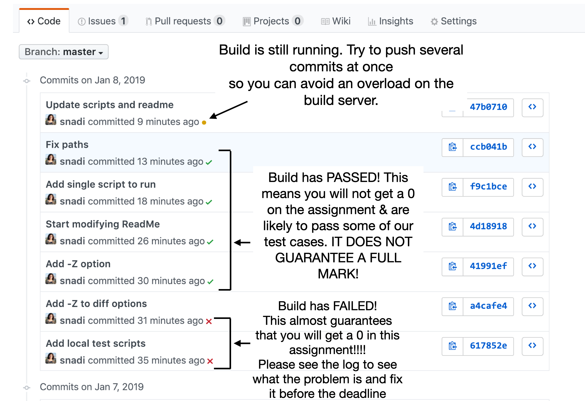
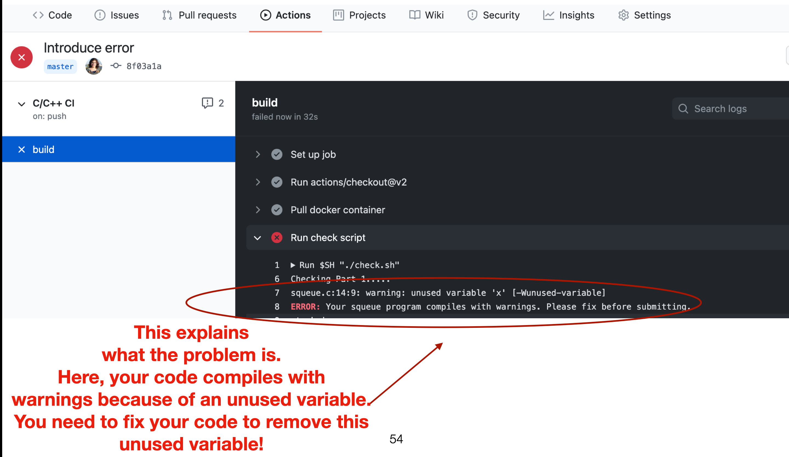

# Overview 

This file describes the files provided to you in this repository

# Files

DO NOT DELETE ANY OF THE FILES BELOW FROM YOUR REPO.

* `LICENSE.md`: contains the CMPUT 201 license. Please replace `<student name>` with your name.
* `RepoStructure.md`: this file
* `.github/workflows`: this is the GitHub Actions configuration that automates the continuous integration checking of your assignment with every push. You should never need to touch this file unless you really know what you are doing. We are not responsible for any changes you make to this file.
* `check_general_requirements_ci.sh`: this is the checking script that will run with every push to check that all your required files are availble. If this script shows any warnings or errors, you are very likely to get a 0.
* `LocalTestScripts`: two scripts similar to the above but that you can run locally to test your code before pushing to github. There's a ReadMe file inside that folder that explains things.
* `test_program.sh`: this is the testing script that will run with every push of your code. This runs some basic tests. IT DOES NOT GUARANTEE A FULL MARK! However, if this script shows any warnings or errors, you are very likely to get a 0.
* `SampleTests`: a folder containing 2 sample test cases.
* `The Rabin-Karp Algorithm (from Introduction to Algorithms Third Edition).pdf`: this is a chapter from the textbook with a detailed explanation of the Rabin-Karp algorithm
* `images`: ignore this folder. It is just the images used to explain things in this file.

# Notes about CI

* If you click on the `Actions` tab shown at the top of your github repo, you will see the check/build status of your commits. See pic below for what each symbol means:

* Let's assume you get a red cross, which means there's something you need to fix. Click on that red cross, and then click on Details in the popup that appears. Scroll down in the webpage you go to and click on "View more details on Travis CI". It will take you to a page that shows the details of the build and you can figure out what's wrong similar to the figure below:

* As you develop your assignment, it is OK for the build status to remain as failing for a while until your code manages to pass all the tests and checks provided in the scripts. The important thing is that your build should pass (green check) before the deadline.
